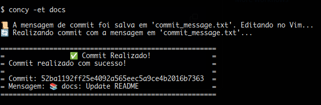

# CTY

<div align="center">
  <p>cty - Conventional Commits CLI</p>
</div>


> It is a tool designed to encourage the use of the Conventional Commits standard, still in development. The next step is to consider a DevOps implementation so that the tool can be used and contribute to pipelines, whether manually or automatically.

## What is Conventional Commits?
The [Conventional Commits](https://www.conventionalcommits.org/en/v1.0.0/) specification is a lightweight convention on top of commit messages.

The commit message should be structured as follows:

```plaintext
<type>[optional scope]: <description>

[optional body]

[optional footer(s)]
```

## How does the tool work?
```bash

# .bashrc
alias cty='python3 /home/.../cty/cli.py'

usage: cty [-h] -t {fix,feat,docs,style,refactor,test,chore,build,ci,perf,revert} [--emoji] [-m MESSAGES]


options:
  -h, --help            show this help message and exit
  -t {fix,feat,docs,style,refactor,test,chore,build,ci,perf,revert}, --type {fix,feat,docs,style,refactor,test,chore,build,ci,perf,revert}
                        Commit type (fix, feat, docs, style, refactor, test, chore, build, ci, perf,
                        revert)
  --emoji, -e           Commit type with emojis
  -m MESSAGES, --messages MESSAGES
                        Displays commit messages examples. Use -m <type> for a specific message.
```
<div align="center"></div>

